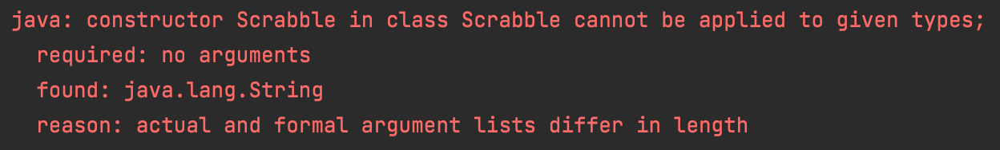

<a name="readme-top"></a>

<!-- PROJECT SHIELDS -->
[![Contributors][contributors-shield]][contributors-url]
[![Forks][forks-shield]][forks-url]
[![Issues][issues-shield]][issues-url]
[![LinkedIn][linkedin-shield]](https://www.linkedin.com/in/sophie-beard-9a9842222/)


<!-- PROJECT LOGO -->
<br />
<div align="center">

<h3 align="center">Digital Future's Scrabble Challenge</h3>

  <p align="center">
    This was the third challenge as part of the Digital Futures Academy. This challenge was carried out before the start of the academy, so the task was to convert the JavaScript challenge into Java language, and improve it. The tests in this project were pre-written. 
    <br />
    <a href="https://github.com/sophiebeard/scrabble-challenge-java"><strong>Explore the docs »</strong></a>
    <br />
    <br />
    <a href="https://github.com/sophiebeard/scrabble-challenge-java">Report Bug</a>
  </p>
</div>


<!-- TABLE OF CONTENTS -->
<details>
  <summary>Table of Contents</summary>
  <ol>
    <li>
      <a href="#about-the-project">About The Project</a>
    </li>
    <li>
      <a href="#project-plan">Project Plan</a>
    </li>
    <li><a href="#project-review-and-roadmap">Project Review and Roadmap</a></li>
    <li><a href="#contributing">Contributing</a></li>
    <li><a href="#contact">Contact</a></li>
    <li><a href="#acknowledgments">Acknowledgments</a></li>
  </ol>
</details>


<!-- ABOUT THE PROJECT -->
## About The Project

# Scrabble Challenge - this time in Java!

Welcome to the Scrabble challenge!

## Learning Objectives
- Build a simple program using functions, loops, and flow control
- Use `git` & GitHub to commit work and open a Pull Request

## Instructions

1. Fork this repository and then clone your copy:
```sh
$ git clone <YOUR GITHUB DETAILS>/scrabble-challenge.git && cd scrabble-challenge
```
2. Run the tests from IntelliJ. There should be a failing test to begin with. You can run your test suite in a few ways:
   1. Right-click on the project and then select `Run all Tests`
   2. Right-click on the `ScrabbleTest` and click `Run ScrabbleTest`
   3. Open the class file `ScrabbleTest` and click the "Play" button to the left of the class declaration

Your first error when running the tests should be this:



3. In GitHub, [open a Pull Request](https://docs.github.com/en/github/collaborating-with-issues-and-pull-requests/creating-a-pull-request) from your forked repository to the challenge repository.
4. Implement the criteria below locally and [push your code](https://docs.github.com/en/github/managing-files-in-a-repository/adding-a-file-to-a-repository-using-the-command-line) to your repository! Every push to a branch that has an open Pull Request will update it automatically with your changes.

# Task

Given a word, compute the scrabble score for that word.

##### Letter Values

You'll need these:

| Letter                        | Value  |
| ----                          |  ----  |
| A, E, I, O, U, L, N, R, S, T  |     1  |
| D, G                          |     2  |
| B, C, M, P                    |     3  |
| F, H, V, W, Y                 |     4  |
| K                             |     5  |
| J, X                          |     8  |
| Q, Z                          |     10 |

Example
"cabbage" should be scored as worth 14 points:

- 3 points for C
- 1 point for A, twice
- 3 points for B, twice
- 2 points for G
- 1 point for E

And to total:

```
3 + 2x1 + 2x3 + 2 + 1
= 3 + 2 + 6 + 3
= 14
```

## Acceptance Criteria

```java

class ScrabbleRunner {

   public static void main(String[] args) {
      Scrabble scrabble = new Scrabble("");
      scrabble.score();   // => 0

      scrabble = new Scrabble(null);
      scrabble.score();   // => 0

      scrabble = new Scrabble("a");
      scrabble.score(); // => 1

      scrabble = new Scrabble("f");
      scrabble.score(); // => 4

      scrabble = new Scrabble("street");
      scrabble.score(); // =>, 6

      scrabble = new Scrabble("quirky");
      scrabble.score(); // => 22

      scrabble = new Scrabble("OXYPHENBUTAZONE");
      scrabble.score(); // => 41
   }
}
```

## Extended Acceptance Criteria
> Each `Scrabble` method should be no more than 5 lines and contain no more than 5 operations.

> You can play a double or a triple letter.

> You can play a double or a triple word.

<p align="right">(<a href="#readme-top">back to top</a>)</p>


### Project Plan

####Domain Model

| Objects         | Properties | Messages | Output |
|-----------------|--|----------|--------|
| Scrabble  | word@String  | ||
|                 | score@Int | ||
|                 | doubleWord@Boolean | ||
|               | tripleWord@Boolean |||
|                 | doubleLetter@ArrayList<Character> |||
|                 | tripleLetter@ArrayList<Character> |||
|                 | alphabet@HashMap<Character, Integer> |||
|||Scrabble(@Sting, Character@Array, Character@Array, @Boolean, @Boolean| @Void|
|||score()|@Int|
|||point(@String)|@Int|
|||getLetterScore(@Char)|@Int|
|||doubleWord(@Int)|@Int|
|||tripleWord(@Int)|@Int|
|||doubleLetter(ArrayList<Character>|@Int|
|||tripleLetter(ArrayList<Character>|@Int|
|||setAlphabet()|@Void|

####Tests

1. Test that no input returns 0 points.
2. Test that a null input returns 0 points.
3. Test that a character returns the correct amount of points.
4. Repeat test 3 with a different character.
5. Test that a simple word returns the correct amount of points. 
6. Test that a complicated word returns the correct amount of points.
7. Test that the system is case insensitive.
8. Test that a word score is doubled with doubleWord().
9. Test that a word score is tripled with tripleWord().
10. Test that a double letter doubles the points for that letter.
11. Test that double letter only works once for one character. 
12. Test that a triple letter triples the points for that letter.
11. Test that triple letter only works once for one character.
12. Test that a double and triple letter word can be played.

<p align="right">(<a href="#readme-top">back to top</a>)</p>


<!-- ROADMAP -->
## Project Review and Roadmap

- [] This challenge was the first Java challenge that I attempted. It was my first time using IntelliJ. Even though it was the second time completing this challenge (previously in JS), it was my first time attempting the extended criteria.
- [] This was my first attempt using ArrayLists and HashMaps. I would have liked to have attempted to make the double and triple letter scores into one method.
- [] One thing that I could have done to improve the quality of the code is to find a better way to implement the method setAlphabet(), as this is currently containing lots of repeated values. This could have been achieved using a more complex key, such as an array of Characters. 
- [] Everytime that I create an intance of Scrabble, I initialise the HashMap as I am calling the setAlphabet() inside the constructor. In OOP, the goal is to look for opportunities to remove data that every instance of the class uses from being a property of the instance to a property of the class itself - i.e. make it static - there was an opportunity to do this with the letter score data structure. 
<p align="right">(<a href="#readme-top">back to top</a>)</p>


<!-- CONTRIBUTING -->
## Contributing

Contributions are encouraged and greatly appreciated! If you have a suggestion for what could make this better, please fork the repo and create a pull request. Thanks!

1. Fork the Project
2. Create your Feature Branch (`git checkout -b feature/AmazingFeature`)
3. Commit your Changes (`git commit -m 'Add some AmazingFeature'`)
4. Push to the Branch (`git push origin feature/AmazingFeature`)
5. Open a Pull Request

<p align="right">(<a href="#readme-top">back to top</a>)</p>


<!-- CONTACT -->
## Contact

Sophie Beard - beardsophie@outlook.com

Project Link: [https://github.com/sophiebeard/scrabble-challenge-java](https://github.com/sophiebeard/scrabble-challenge-java)

<p align="right">(<a href="#readme-top">back to top</a>)</p>


<!-- ACKNOWLEDGMENTS -->
## Acknowledgments

Use this space to list resources you find helpful and would like to give credit to. I've included a few of my favorites to kick things off!

* This README file was formatted from othneildrew's [template](https://github.com/sophiebeard/Best-README-Template).

<p align="right">(<a href="#readme-top">back to top</a>)</p>


<!-- MARKDOWN LINKS & IMAGES -->
<!-- https://www.markdownguide.org/basic-syntax/#reference-style-links -->
[contributors-shield]: https://img.shields.io/github/contributors/othneildrew/Best-README-Template.svg?style=for-the-badge
[contributors-url]: https://github.com/othneildrew/Best-README-Template/graphs/contributors
[forks-shield]: https://img.shields.io/github/forks/othneildrew/Best-README-Template.svg?style=for-the-badge
[forks-url]: https://github.com/othneildrew/Best-README-Template/network/members
[stars-shield]: https://img.shields.io/github/stars/othneildrew/Best-README-Template.svg?style=for-the-badge
[stars-url]: https://github.com/othneildrew/Best-README-Template/stargazers
[issues-shield]: https://img.shields.io/github/issues/othneildrew/Best-README-Template.svg?style=for-the-badge
[issues-url]: https://github.com/othneildrew/Best-README-Template/issues
[license-shield]: https://img.shields.io/github/license/othneildrew/Best-README-Template.svg?style=for-the-badge
[license-url]: https://github.com/othneildrew/Best-README-Template/blob/master/LICENSE.txt
[linkedin-shield]: https://img.shields.io/badge/-LinkedIn-black.svg?style=for-the-badge&logo=linkedin&colorB=555
[linkedin-url]: https://linkedin.com/in/othneildrew
[product-screenshot]: images/screenshot.png
[Next.js]: https://img.shields.io/badge/next.js-000000?style=for-the-badge&logo=nextdotjs&logoColor=white
[Next-url]: https://nextjs.org/
[React.js]: https://img.shields.io/badge/React-20232A?style=for-the-badge&logo=react&logoColor=61DAFB
[React-url]: https://reactjs.org/
[Vue.js]: https://img.shields.io/badge/Vue.js-35495E?style=for-the-badge&logo=vuedotjs&logoColor=4FC08D
[Vue-url]: https://vuejs.org/
[Angular.io]: https://img.shields.io/badge/Angular-DD0031?style=for-the-badge&logo=angular&logoColor=white
[Angular-url]: https://angular.io/
[Svelte.dev]: https://img.shields.io/badge/Svelte-4A4A55?style=for-the-badge&logo=svelte&logoColor=FF3E00
[Svelte-url]: https://svelte.dev/
[Laravel.com]: https://img.shields.io/badge/Laravel-FF2D20?style=for-the-badge&logo=laravel&logoColor=white
[Laravel-url]: https://laravel.com
[Bootstrap.com]: https://img.shields.io/badge/Bootstrap-563D7C?style=for-the-badge&logo=bootstrap&logoColor=white
[Bootstrap-url]: https://getbootstrap.com
[JQuery.com]: https://img.shields.io/badge/jQuery-0769AD?style=for-the-badge&logo=jquery&logoColor=white
[JQuery-url]: https://jquery.com


